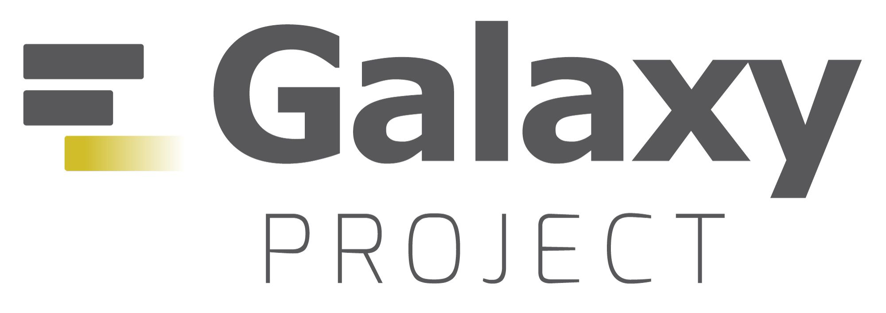
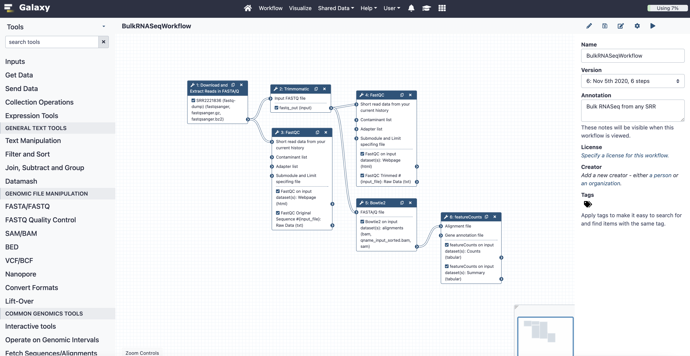

.. _galaxy:

Galaxy
======

`Galaxy <https://usegalaxy.org/>`_ is an open-source web application built for scientific analyses featuring a public server located within the cloud, accessible open-source software packages, custom Galaxy tools (Galaxy ToolShed), and a user-friendly drop-and-drop interface. The platform is easy to learn, requiring no programming experience, and used to build reproducible bioinformatics workflows. Galaxy's community also serves as one of the few active forums for bioinformaticians to collaborate, with over 150 active members monthly. 

Multiple tools are available to the user, including popular ones such as FastQC (quality control), Bowtie2 (aligner), featureCounts (count reads in genes), and many more. Galaxy's built-in drag-and-drop workflow also serves as a transparent way to quickly communicate analyses to other researchers and collaborators.

Galaxy is great for genomic analyses, as there are some drawbacks to the platform. Overall, it's one of the few cloud-based community hubs for bioinformaticians of all skill-levels. The Galaxy community is only getting stronger - with over 124,000 registered users since its inception in 2007 and over 2000 GalaxyHelp members total. 

    The Galaxy UI. The lefthand sidebar shows the tools available to the user. The center features a workflow for Bulk RNASeq. The righthand sidebar shows additional information.

Getting Started with Galaxy 
---------------------------
Utilize the `Galaxy Training pages <https://training.galaxyproject.org/training-material/>`_ to understand what workflows are possible for Galaxy and a specific workflow is the `Bulk RNA Seq Analysis <https://training.galaxyproject.org/training-material/topics/transcriptomics/tutorials/ref-based/tutorial.html#data-upload>`_ Galaxy tutorial

Benefits
--------

1. **Easy to use** A Drag-and-Drog interface allows users to quickly understand where the data is located and what is happening every step of the workflow. This helps really helps both those who are in and outside of the lab. Anybody can quickly understand the input and output of a workflow. 

2. **Cloud-based server** This enables bioinformaticians to quickly save and store information without the fear of it being lost on some random computer's filesystem or stored on an accidentally corrupted USB. Workflows and stored data can be shared via URL links. 

3. **Many tools available** The bioinformatics field constantly pushes out "novel" tools, but at a rate that might be too difficult to keep up with. Galaxy's tools provides an easy search function to find these tools at their most up-to-date version. A bioinformatician who previously was unaware of a tool might discover it and realize it's a much better implementation, thus improving their workflow's analysis. This is a great way for people to distribute their tools and have people actually use them. 

4. **Galaxy's training docs are well maintained and applicable** The Galaxy community shines in making training for applied projects. The documents are interactive, often featuring video, slides, transcript, written tutorial, etc. The training documents provide a great way to understand the extent that Galaxy can help with your project. 

5. **Galaxy is constantly being updated to be more user-friendly and advanced** Not only does it have workflow management, Galaxy also boasts many tools for data visualization and even a Jupyter Notebook feature. 

Drawbacks
---------
1. **Possible lack of customization** Some tools may not include all options that the tool would offer if manually installed. Ex. Operate on Genomic Intervals:Intersect and BED:bedtools Intersect intervals are the same tool yet bedtools offers more options for the user to set.

2. **Confusing documentation** Some tools only have a link to the tool's original document. This may be difficult to understand. 

3. **Lots of tools** The naming of the tools splits between Galaxy-programmed tools and Galaxy-adapted tools created by other pre-existing packages. Ex. In the "Get Data" tab, there are two options to get data from NCBI SRA that look very similar: "Faster Download and Extract Reads in FASTQ" and "Download and Extract Reads in FASTA/Q". 

A great example of a well documented tool is "Download and Extract reads in FASTA/Q". It is a simple tool with understandable documentation. It also has flags for what Galaxy is internally doing and how Galaxy will output these files to the user.

Papers
------
`The Galaxy platform for accessible, reproducible and collaborative biomedical analyses: 2018 update (Afghan, et al. 2018) <https://www.ncbi.nlm.nih.gov/pmc/articles/PMC6030816/>`_
