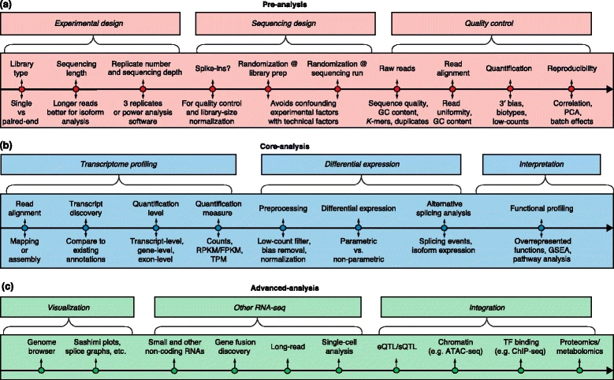

Bulk RNA-seq analysis
=====================

The basic steps in bulk RNA-seq analysis are:

- quality control (FastQC, MultiQC, many other tools)
- trim reads if needed (cutadapt, fastp)
- align reads to genome (HISAT2, STAR)
- count reads in genes (featureCounts)
- run differential expression analysis (DESeq2, edgeR)

Fig 1. Generic roadmap for RNA-seq computational analyses, see `Conesa et al 2016 <https://doi.org/10.1186/s13059-016-0881-8>`_. 

**The best place to learn** this is probably the Harvard Bioinformatics Core
training material. It’s still under development, but most of it is accessible
here on their `main training page <https://github.com/hbctraining/main>`_.
Specifically, you'll probably want to check out:

- `Introduction to (bulk) RNA-seq using High-Performance Computing <https://hbctraining.github.io/Intro-to-rnaseq-hpc-salmon-flipped/schedule/links-to-lessons.html>`_
- `Introduction to Differential Gene Expression Analysis <https://hbctraining.github.io/DGE_workshop_salmon_online/schedule/links-to-lessons.html>`_

Note that these have prerequisites of `Introduction to shell <https://hbctraining.github.io/Intro-to-shell-flipped/schedule/links-to-lessons.html>`_
and `Introduction to R <https://hbctraining.github.io/Intro-to-R-flipped/schedules/links-to-lessons.html>`_ respectively.

.. note::

    The Harvard Bioinformatics Core tutorials sometimes change locations or get
    updated or split. The above links are checked periodically for correctness,
    but if you can't find the linked tutorials, look around on their
    `main training page <https://github.com/hbctraining/main>`_.

The remainder of this page goes into some more detail on various aspects of
RNA-seq analysis.

Experimental design
-------------------

The `experimental planning considerations <https://hbctraining.github.io/Intro-to-rnaseq-hpc-salmon-flipped/lessons/02_experimental_planning_considerations.html>`_
section from HBC training is a very good discussion on how much to sequence
(more samples or more depth?), how to avoid a confounded experiment, and
preventing batch effects in general.

Especially when doing `in vitro` research with cell lines, it's important to
think about what a replicate really is. `This blog post
<https://paasp.net/accurate-design-of-in-vitro-experiments-why-does-it-matter/>`_
is a good discussion of the difference between technical replicates and
biological replicates `in vitro`.

Strandedness in RNA-seq
-----------------------

Depending on what kit was used for the library prep, a library may be stranded,
reverse stranded, or unstranded. `These figures
<https://github.com/igordot/genomics/blob/master/notes/rna-seq-strand.md>`_
help visualize the different strand-specific protocols. If you're unsure,
RSeQC's `infer_experiment.py
<http://rseqc.sourceforge.net/#infer-experiment-py>`_ can help you figure it
out given a BAM and a BED file of genes. 

Running your own differential expression analysis
-------------------------------------------------

When you’re ready, try your hand at analyzing a real-world RNA-seq data
set. The best thing to do would be to find data from a paper of interest and
try to reproduce it.

Here’s a published experiment:
https://www.ncbi.nlm.nih.gov/geo/query/acc.cgi?acc=GSE93737. This is
Drosophila melanogaster RNA-seq data from a recent paper.

The counts table is available, if you want to focus on that part in R,
or you can access the raw data from SRA and run from scratch. Note that
this experiment has more than just two treatments. To start, try just
identifying the genes differentially expressed between larvae and pupae
(the dicer-gfp_x_larva_neuron replicates vs the dicer-gfp_x_pupal_neuron
replicates).

You may have heard the terms RPKM, FPKM, RPM, and TPM. Which to use? Short
answer: TPM. Longer answer, with figures, is here:
https://ro-che.info/articles/2016-11-28-rna-seq-normalization. The accompanying
`slides <https://ro-che.info/docs/2016-11-27-rna-seq.pdf>`_ are useful for
discussion.

Other resources
---------------

To start digging into details:

- We base part of our RNA-seq template off of the `Bioconductor RNA-seq
  workflow
  <https://www.bioconductor.org/packages/devel/workflows/vignettes/rnaseqGene/inst/doc/rnaseqGene.html>`_, which shows all the steps of RNA-seq from within R.
- The `DESeq2 vignette
  <https://bioconductor.org/packages/release/bioc/vignettes/DESeq2/inst/doc/DESeq2.html>`_
  is the authoritative source on how to use DESeq2.
- The `DESeq2 paper
  <https://genomebiology.biomedcentral.com/articles/10.1186/s13059-014-0550-8>`_
  is very well written, and describes how DESeq2 is actually working

- A nice treatment of `interaction terms
  <http://genomicsclass.github.io/book/pages/interactions_and_contrasts.html>`_,
  along with plots to help understand what's being tested.

- For complex experimental designs, this `tutorial
  <https://github.com/tavareshugo/tutorial_DESeq2_contrasts/blob/main/DESeq2_contrasts.md>`_
  shows an elegant, general method for creating the proper contrasts.

.. todo::

    This RNA-seq page needs some better organization.
